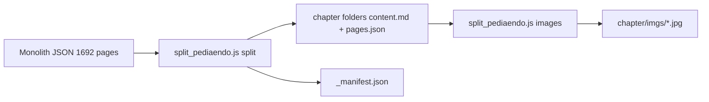

# Split pediaendo OCR into chapter folders

## What you have

Source: [`/Users/dr.ajayshukla/Downloads/pediaendo/`](file:///Users/dr.ajayshukla/Downloads/pediaendo/)

| File | Size / role |
|------|-------------|
| `endoped.pdf_by_PaddleOCR-VL-1.6.md` | ~42k lines, single concatenated markdown |
| `endoped.pdf_by_PaddleOCR-VL-1.6.json` | 1,692 page objects (`markdown.text`, `markdown.images`, `prunedResult`, …) |

**Important:** the OCR bundle is **3 books**, not one. Page 0 even lists all three with offsets:

```text
Clinical Rounds in Endocrinology Vol II - Pediatric Endocrinology … page 2
Pediatric Endocrinology: A Practical Clinical Guide (2024) … page 452
Diagnostic Protocols in Endocrinology (2024) … page 1564
```

| Book | Page range (0-based) | Chapters | Images |
|------|---------------------|----------|--------|
| Clinical Rounds Vol II | 0–471 | 12 | ~458 |
| Practical Clinical Guide | 472–1574 | 39 | ~278 |
| Diagnostic Protocols | 1575–1691 | 6 | ~38 |

Chapter boundaries are reliable via `^## {N}.1 ` in page markdown (matches the TOC at lines 182–238 for Book 1).

**Default assumption (you skipped scope questions):** split **all 3 books**, output under `pediaendo/chapters/` with book subfolders to avoid duplicate chapter numbers.

## Target layout

```
/Users/dr.ajayshukla/Downloads/pediaendo/
  endoped.pdf_by_PaddleOCR-VL-1.6.md          # keep originals untouched
  endoped.pdf_by_PaddleOCR-VL-1.6.json
  chapters/
    _manifest.json
    clinical_rounds/
      000_front_matter/content.md
      001_Disorders_of_Growth_and_Development_Clinical_Perspectives/
        content.md
        pages.json
        imgs/
          img_in_image_box_107_123_437_419.jpg
      002_…/
      … (12 chapters)
    practical_guide/
      000_front_matter/ …
      001_…/ … (39 chapters)
    diagnostic_protocols/
      000_front_matter/ …
      001_…/ … (6 chapters)
```

This mirrors Harrison authoring: [`<NNN>_<Chapter_Name>/content.md`](file:///Users/dr.ajayshukla/harrison_app/.claude/skills/mcq_skill/SKILL.md) as the human-readable source, with images co-located for later Q-bank work.

## Implementation approach

Add a reusable script at [`scripts/split_pediaendo.js`](file:///Users/dr.ajayshukla/harrison_app/scripts/split_pediaendo.js) (same pattern as [`scripts/build_nejm_trials.js`](file:///Users/dr.ajayshukla/harrison_app/scripts/build_nejm_trials.js)):

```bash
node scripts/split_pediaendo.js split
node scripts/split_pediaendo.js images   # download + rewrite paths
node scripts/split_pediaendo.js all      # both steps
```

### Step 1 — `split`: chapter detection + file emission

1. **Load JSON** (primary truth for page boundaries and images).
2. **Define 3 book configs** with `startPage`, `endPage`, `slug`, `title`, and chapter-detection regex `^##\s+(\d+)\.1\s+`.
3. **Detect chapter start pages** per book; end page = next chapter start − 1 (last chapter → book `endPage`).
4. **Front matter** (book pages before first `## 1.1`): write to `{book}/000_front_matter/content.md` + `pages.json`.
5. **Per chapter folder** `{NNN}_{slug}/`:
   - **`content.md`**: concatenate `pages[i].markdown.text` for the chapter’s page slice, separated by `\n\n`; prepend a small header block (`# Chapter N: Title`, book title, page range).
   - **`pages.json`**: structured slice, not a raw dump:

```json
{
  "book": "clinical_rounds",
  "bookTitle": "Clinical Rounds in Endocrinology Vol II - Pediatric Endocrinology",
  "chapterNo": 1,
  "chapterTitle": "Disorders of Growth and Development: Clinical Perspectives",
  "folder": "001_Disorders_of_Growth_and_Development_Clinical_Perspectives",
  "sourceFile": "endoped.pdf_by_PaddleOCR-VL-1.6.json",
  "pageStart": 21,
  "pageEnd": 64,
  "pageCount": 44,
  "pages": [ /* original page objects for this slice */ ]
}
```

6. **`_manifest.json`** at `chapters/` root: catalog of all folders (book, chapterNo, title, paths, page range, image count) for downstream authoring / bootstrap.

**Slug rules:** lowercase, ASCII, non-alphanumerics → `_`, trim, max ~60 chars (same spirit as NEJM `fileSlug` in `build_nejm_trials.js`).

### Step 2 — `images`: extract pictures into chapter `imgs/`

Images live in `pages[i].markdown.images` as `{ "imgs/foo.jpg": "https://pplines-online.bj.bcebos.com/…" }` (774 entries total). The monolithic `.md` uses the same CDN URLs inline.

For each chapter:

1. Collect all image keys/URLs from its page slice.
2. **Download** each unique URL → `{chapter}/imgs/{basename}` (e.g. `img_in_image_box_107_123_437_419.jpg`).
   - Concurrency limit (~8), retries, skip if file already exists (idempotent re-runs).
   - Requires network (`full_network` permission when executing).
3. **Rewrite `content.md`**: replace CDN URLs and `imgs/…` references with relative `imgs/{basename}`.
4. **Augment `pages.json`**: add `localImages` map `{ "imgs/foo.jpg": "imgs/foo.jpg" }` per page for traceability; optionally strip long CDN URLs from embedded `pages[].markdown.images` after download to shrink files.



## Book 1 chapter map (verified)

| Ch | Title | MD line start | JSON page start |
|----|-------|---------------|-----------------|
| 1 | Disorders of Growth… Clinical Perspectives | 248 | 21 |
| 2 | … Diagnosis and Treatment | 867 | 65 |
| 3 | Thyroid Disorders in Children | 1272 | 91 |
| 4 | Childhood Cushing's Syndrome | 1817 | 128 |
| 5 | Rickets–Osteomalacia | 2113 | 149 |
| 6 | Precocious Puberty | 2697 | 189 |
| 7 | Delayed Puberty | 3292 | 229 |
| 8 | Turner Syndrome | 3965 | 278 |
| 9 | Disorders of Sex Development | 4413 | 308 |
| 10 | Congenital Adrenal Hyperplasia | 4990 | 352 |
| 11 | Multiple Endocrine Neoplasia | 5694 | 394 |
| 12 | Diabetes in the Young | 6073 | 418 |

Books 2–3 use the same page-based `## N.1` detection (39 and 6 chapters respectively).

## Validation after run

- `_manifest.json` lists **57 chapter folders + 3 front-matter folders**.
- Spot-check ch.1: case vignette (“9-year-old boy…”) present; Fig. 1.1 images load from local `imgs/`.
- Re-run `images` is idempotent (no re-download of existing files).
- Original monolith files unchanged.

## Out of scope (this task)

- No Q-bank JSON (`data/*.json` with notes/MCQs) — that is a separate authoring pass using the new `content.md` sources.
- No changes to [`harrison_app`](file:///Users/dr.ajayshukla/harrison_app/) app or `index.json` unless you later bootstrap a pediatric-endo Q-bank repo.

## If you want a narrower split later

Re-run with a filtered book list in the script config (e.g. only `clinical_rounds` → 12 folders) without touching originals.
